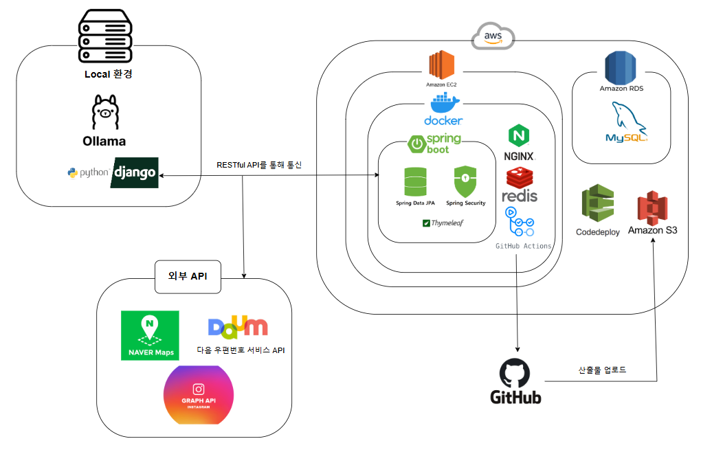
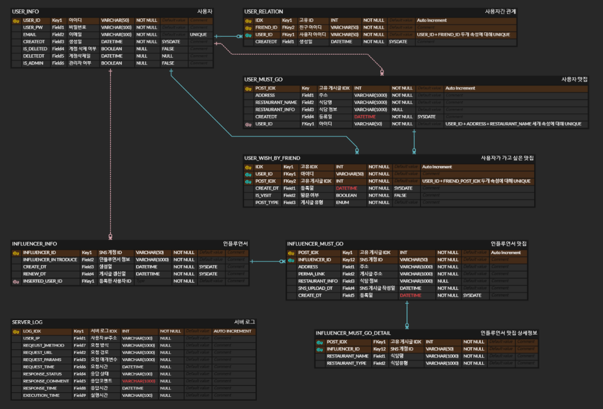
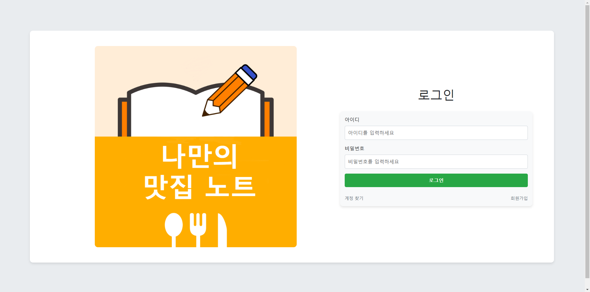
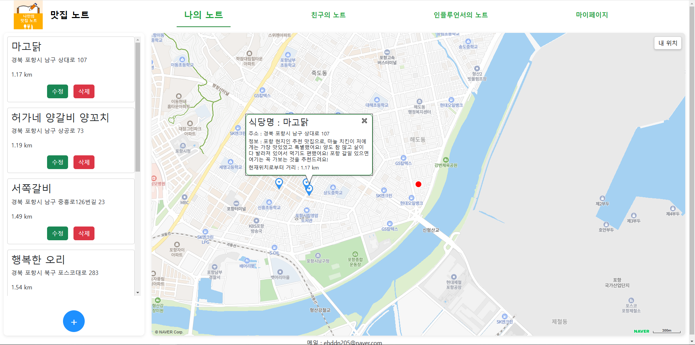

# 🍴  SNS 맛집 노트(1인 프로젝트)

### 💻프로젝트 개요
#### 사용자가 관심있는 SNS(인스타그램)의 인플루언서 게시물을 바탕으로 맛집을 탐색할 수 있는 플랫폼으로, 자신만의 맛집을 기록하고 다른 사용자와 공유할 수 있는 웹사이트입니다.

### 🎯서비스 핵심기능
#### 1. 인스타그램 기반 맛집 조회
#### 2. 자신의 맛집, 가고싶은 식당 기록 및 공유

### 🛠기술 스택
OS | Windows 10
--- | --- |
Language | 
Framework |  
Build Tool | 
Database |  
Frontend |      
Server |  
Library |  
API |   
Version Control | 
CI/CD | 
Cloud Services |    

### 🚧시스템 아키텍처
|시스템 아키텍처|
| :-: |
||
### 📖ERD
|ERD 다이어그램|
| :-: |
||
### 🚀기능 구현
|로그인|나의 맛집 노트 조회|나의 맛집 노트 추가|
| :-: | :-: | :-: |
|||

### ✨기술적 의사결정
|선택 기술|선택 이유 및 근거|
| :-: | :-: |
|Spring Security|1. 강력한 인증/인가: 다양한 인증 메커니즘(예, JSON 기반 로그인, 커스텀 필터) 제공  2.암호화 지원: BCryptPasswordEncoder를 통한 안전한 비밀번호 암호화  3. 유연한 확장성: CustomUserDetailService, UserDetailsAdapter 등을 통해 애플리케이션의 사용자 엔티티와 원활하게 통합  4. 상황에 적절한 접근 제어 가능: URL별 접근 권한 설정 및 예외 처리 커스터마이징 가능|
|Redis|1. 고성능 캐싱: 인메모리 저장소를 활용해 DB 부하 감소 및 빠른 데이터 접근   2. 비동기 지원: LettuceConnectionFactory를 이용한 비동기 및 비블로킹 I/O 제공   3. 확장성: 세션 관리, 캐시, 데이터 저장 등의 다양한 요구사항을 효과적으로 처리|
|AWS   (EC2, RDS, S3)|1. 확장성 및 안정성: 필요에 따라 서버 및 데이터베이스를 확장 가능하여 트래픽 증가에 유연하게 대응 가능   2. 관리 부담 감소: AWS가 제공하는 관리형 서비스(RDS, S3)를 활용하여 운영 부담을 줄이고, 유지보수 효율성을 높임   3. 보안 및 백업: IAM을 통한 세밀한 접근 제어, 자동 백업 및 스냅샷 기능 제공

### ✨ 설계 및 구현 방식
|선택 방식|선택 이유 및 근거|
| :-: | :-: |
|Custom Annotation   (@AuthUser)|1. 코드 간결화: 컨트롤러 메서드 파라미터에 인증된 사용자 정보를 간편하게 주입   2. 코드 중복 감소: 매번 SecurityContext에서 사용자 정보를 추출할 필요 없이 어노테이션 하나로 처리
|Custom Exception   (DBException, DuplicateValueException| 1. 의미있는 에러 처리: 도메인별 에러(DBException, DuplicateValueException 등)를 명확하게 구분   2. 일관된 응답: GlobalExceptionHandler를 통해 통일된 에러 응답 구조 제공   3. 유지보수 용이: 에러 처리 로직의 중앙 집중화로 코드 관리 및 디버깅이 수월
|Interceptor   (LoggingInteceptor)|1. 공통 로직 분리: 컨트롤러 코드에서 공통적인 로직(로깅, 인증, 권한 검사 등)을 분리하여 유지보수성을 높임   2. 요청 전/후 처리 가능: preHandle, postHandle, afterCompletion 메서드를 활용해 요청이 처리되기 전과 후의 로직을 실행 가능   3. URL 패턴 기반 적용 가능: 특정 URL 패턴에만 적용할 수 있어, 원하는 요청에 대해 세밀한 로직 제어가 가능   4. 비즈니스 로직과 분리: 요청/응답 로깅, 성능 측정, 보안 검사를 비즈니스 로직과 분리하여 코드의 가독성을 유지할 수 있음
|어탭터 패턴   (UserDetailsAdapter) |1. 호환성 증가: 애플리케이션의 엔티티와 Spring Security를 비롯한 외부 라이브러리의 엔티티와 연결을 하여 기존 코드 변경 없이 통합할 수 있음.   2. 유지보수성 향상: 기존 코드에 영향을 주지 않고 새로운 인터페이스를 추가할 수 있어, 코드 수정 부담을 줄임.   3. 재사용성 증가: 기존 클래스를 수정하지 않고도 다양한 환경에서 재사용 가능하여, 중복 코드 발생을 방지.

### 로그인 구현 과정
Spring Security와 Spring Session을 사용하여 Redis를 기반으로 인증 및 세션 관리를 처리하는 구조
사용자가 로그인 요청을 보내면 Spring Security는 CustomUsernamePasswordAuthenticationFilter를 통해 JSON 기반 요청에서 userId와 userPw를 추출하고 AuthenticationManager에 전달하여 인증을 수행하며, 인증에 성공하면 사용자 정보를 SecurityContext에 저장한 뒤 세션을 통해 Redis에 저장하며, 성공적인 인증 응답으로 JSON 형식의 성공 메시지와 리디렉션 URL을 반환
로그인 이후 다른 페이지에 접근할 경우 SecurityContext가 Redis에 저장된 세션 정보를 기반으로 인증된 사용자 정보를 가져와 권한을 확인한 뒤 요청된 페이지에 접근할 수 있도록 처리